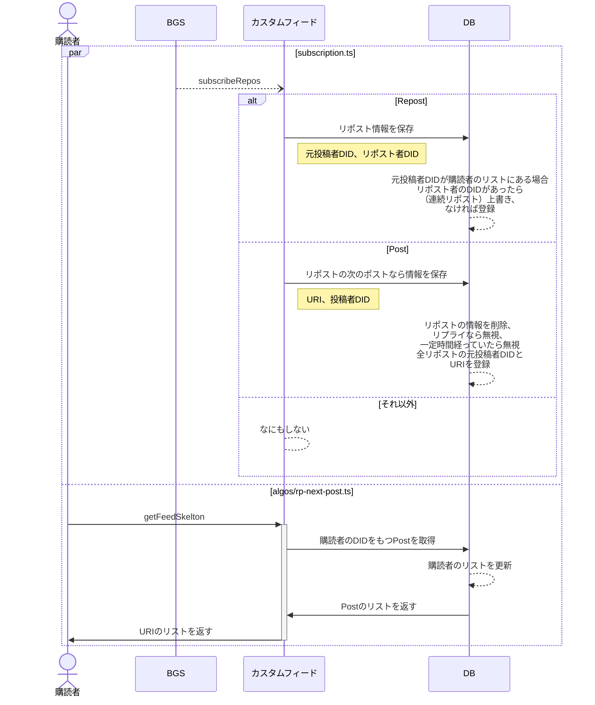

こんな感じでやればいけるかなという思考の試行してた名残

```mermaid
sequenceDiagram
	actor 購読者
	participant BGS
	participant カスタムフィード
  participant  DB

par subscription.ts

  BGS --) カスタムフィード: subscribeRepos
  alt Repost
	  カスタムフィード ->> DB: リポスト情報を保存
	  note right of カスタムフィード: 元投稿者DID、リポスト者DID
	  DB -->> DB: 元投稿者DIDが購読者のリストにある場合<br/>リポスト者のDIDがあったら<br/>（連続リポスト）上書き、<br/>なければ登録
  else Post
	  カスタムフィード ->> DB: リポストの次のポストなら情報を保存
  	note right of カスタムフィード: URI、投稿者DID
    DB -->> DB: リポストの情報を削除、<br/>リプライなら無視、<br/>一定時間経っていたら無視<br/>全リポストの元投稿者DIDと<br/>URIを登録
  else それ以外
  	カスタムフィード --> カスタムフィード: なにもしない
  end

and algos/rp-next-post.ts

  購読者 ->>+ カスタムフィード: getFeedSkelton
  カスタムフィード ->> DB: 購読者のDIDをもつPostを取得
  DB -->> DB: 購読者のリストを更新
  DB ->> カスタムフィード: Postのリストを返す
  カスタムフィード ->>- 購読者: URIのリストを返す

end
```
